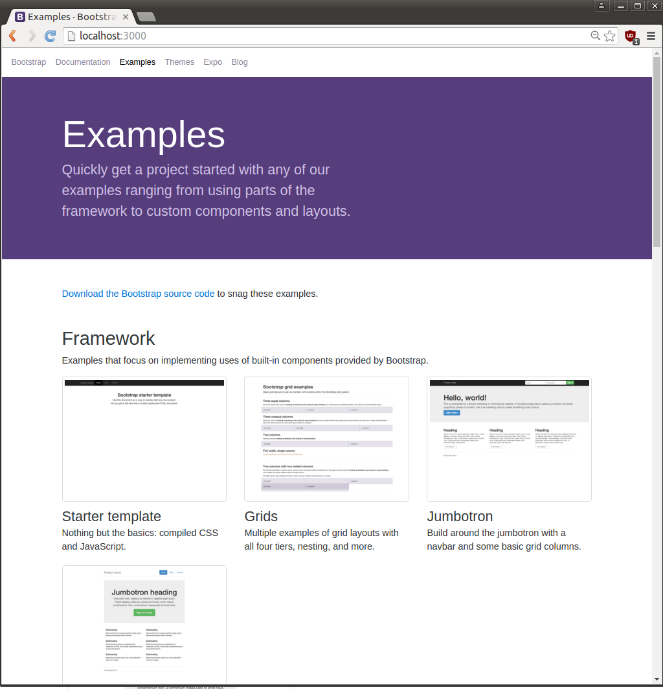
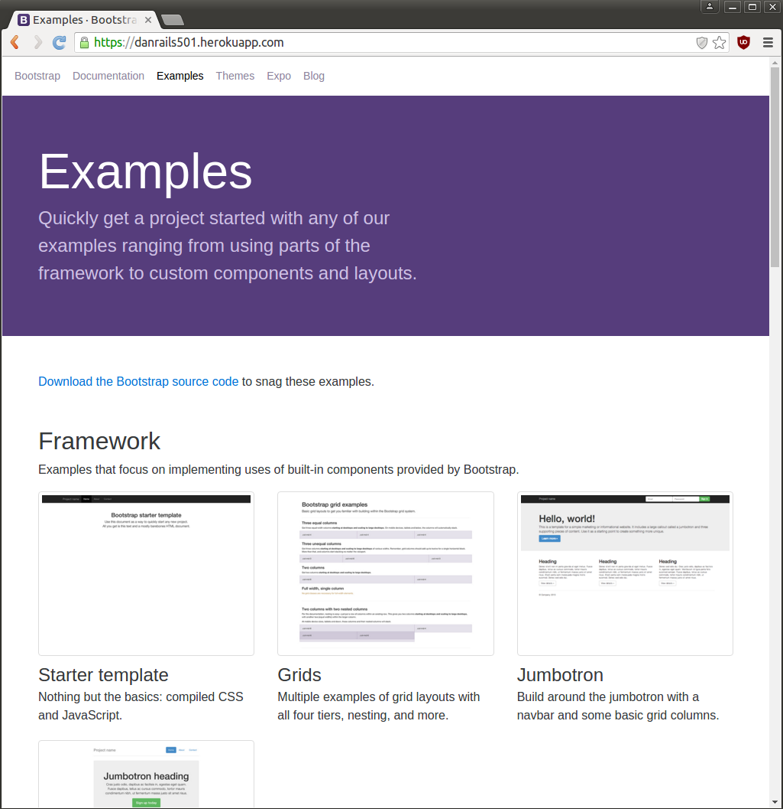

# README

This repository demonstrates how I mix Rails 5 with Twitter Bootstrap-4.

* I started with a windows laptop.

* I replaced windows with Ubuntu 16.04:

* http://releases.ubuntu.com/16.04/ubuntu-16.04-desktop-amd64.iso

* After installation, I enhanced Ubuntu with apt-get shell commands:

```bash
sudo apt-get update
sudo apt-get upgrade

sudo apt-get install autoconf bison build-essential libssl-dev libyaml-dev \
libreadline6-dev zlib1g-dev libncurses5-dev libffi-dev libgdbm3       \
libgdbm-dev libsqlite3-dev gitk postgresql postgresql-server-dev-all  \
libpq-dev emacs wget curl chromium-browser openssh-server aptitude    \
ruby ruby-dev sqlite3
```

* Next, I created an account named rails50 for my Rails 5 efforts:

```bash
sudo useradd -m -s /bin/bash rails50
sudo passwd rails50
```

* I logged into rails50:

```bash
ssh -YA rails50@localhost
```

* In order to install Ruby 2.3.1 I ran some shell commands:

```bash
cd ~
git clone https://github.com/rbenv/rbenv.git      .rbenv
git clone https://github.com/rbenv/ruby-build.git .rbenv/plugins/ruby-build
echo 'export PATH="$HOME/.rbenv/bin:$PATH"' >> ~/.bashrc
echo 'eval "$(rbenv init -)"'               >> ~/.bashrc
bash
rbenv install 2.3.1
rbenv global  2.3.1
gem install bundler
```

* Next I got Postgres ready for Rails:

```bash
sudo su - postgres
psql
CREATE USER     rails50 WITH SUPERUSER LOGIN;
ALTER  USER     rails50 PASSWORD 'rails50';
CREATE DATABASE rails50;
CREATE DATABASE danrails50_development;
^D
^D
```

* Then, I cloned this repository:

```bash
cd ~
git clone https://github.com/danbikle/danrails50
```

* Next, I used bundler to enhance the repository:

```bash
cd ~/danrails50
bundle install
```

* Then, I started the Rails webserver on my laptop:

```bash
cd ~/danrails50
bin/rails server
```

* I used the webserver to serve a page to my browser:



* At that point my dev-env was setup on my laptop.

* I wanted to run danrails50 on Heroku.

* I created an account on heroku.com

* I installed the heroku-client:

```bash
cd ~
wget https://s3.amazonaws.com/assets.heroku.com/heroku-client/heroku-client.tgz
tar zxf heroku-client.tgz
echo 'export PATH="${HOME}/heroku-client/bin:$PATH"' >> ~/.bashrc
bash
```

* I created an ssh-key for rails50:

```bash
ssh-keygen -t rsa
```

* I used the heroku-client to upload the key to heroku:

```bash
heroku keys:add
```

* I used the heroku-client to create an empty app on heroku:

```bash
cd ~/danrails50
heroku create danrails501
```

* I filled the empty app with a git push command:

```bash
cd ~/danrails50
git push heroku master
```

* I used a browser to see the app on heroku:



* The above page convinced me that I made good progress towards blending Rails 5 and Twitter Bootstrap-4.

* If you have questions, e-me (Dan Bikle): bikle101@gmail.com


